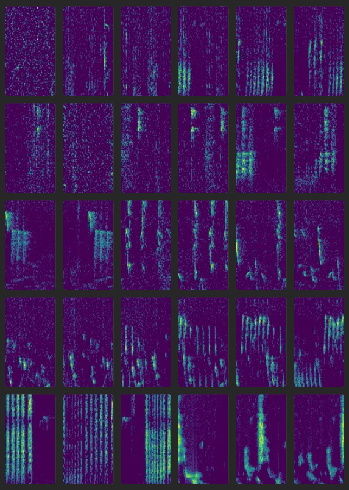
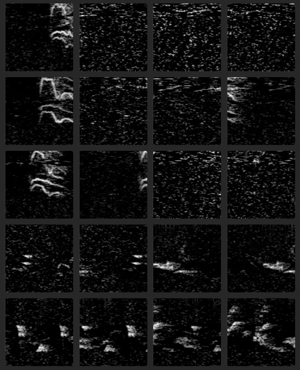
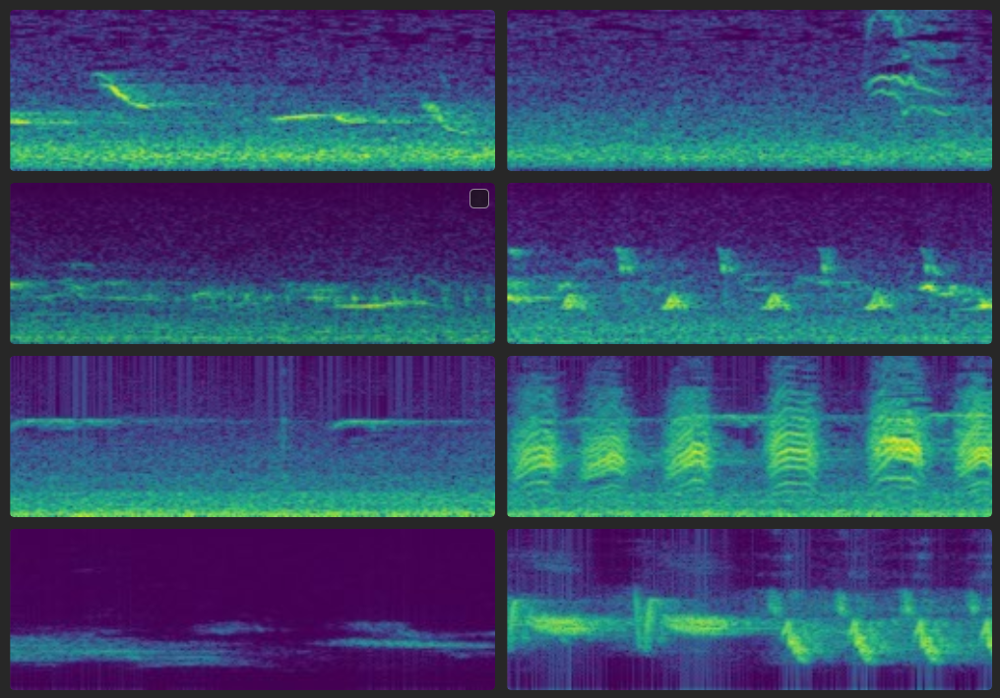

# Xeno-Canto Organizer (XCO)

## Summary
- The data repository of the [Xeno-Canto](https://www.xeno-canto.org/) project is a treasure for ecology and bio-acoustics applications. 
- However, the provide mp3 files cannot be directly used for machine learning (ML). 
- **Xeno-Canto Organizer** is a Python package to prepare Xeno-Canto bio-acoustic audio files **specifically for machine learning projects**

## Features
- Explicit selection of mp3 duration, quality, country, species gives fine control of what is included
- Summarize and filter files based on metadata prior to download.
- Convert MP3 files to WAV format and convert sampling rate (requires ffmpeg).
- Segment into pieces with custom duration and overlap
- Generate spectrograms and stored as PNG images for easy exploration and ingestion by established CNNs
- Spectrogram parameters can be flexibly adjusted
- Also stores the XC meta-data in PKL files that are easy to integrate with Python
- The complete download and preparation process can be handled and replicated with a small python script (example provided)
- Github repo of two ML project based on XCO are [IDNN](https://github.com/sergezaugg/feature_extraction_idnn) and [SAEC](https://github.com/sergezaugg/feature_extraction_saec)

## External dependencies
- This package requires [FFmpeg](https://ffmpeg.org/) installed for mp3 to wav conversion and resampling
- Please follow to official instruction of FFmpeg for installation
- This package uses the XC-API v3 which requires an **API key** available to all registered XC members 
- To register go to https://xeno-canto.org

## Installation (for project usage)
- Make a fresh venv: ``` python -m venv ./ ```
- Install the downloaded package: 
- e.g. ```pip install https://github.com/sergezaugg/xco/releases/download/vx.x.x/xeno_canto_organizer-x.x.x-py3-none-any.whl```

## Usage 
- Minimal example of usage shown below and a longer commented example [here](sample_code.py)

```python
import xeno_canto_organizer.xco as xco
# Store API key in env variable of current session - needed for download_summary()
xco.api_key_to_env()
#---------------------------------
# (Example 2) search can be based on family and larger areas + sampling rate limits 
xc2 = xco.XCO(start_path = './temp_xc_project_02')
xc2.download_summary(fam = "Corvidae", area = "Europe", smp_min = 16000, smp_max = 16000,  len_min = 1, len_max = 10, verbose=True)
xc2.compile_df_and_save(verbose = True)
xc2.download_audio_files(verbose=True)
xc2.mp3_to_wav(conversion_fs = 8000)
xc2.extract_spectrograms(fs_tag = 8000, segm_duration = 1.0, segm_step = 0.5, win_siz = 256, win_olap = 220.5, 
                        max_segm_per_file = 20, specsub = True, log_f_min = None, colormap='gray')
```
:smirk: Now you can throw your PyTorch magics at those PNGs :wink: 

## Illustration
* The figures below are snapshot of a few spectrograms obtained with this tool 




<!-- <figcaption>(spectral subtraction 3-ch color, spectral subtraction 1-ch gray, 3-ch color)</figcaption> -->

## Why save spectrogram of sounds as PNG images
* It is handy because many PyTorch models and data augmentation procedures can directly ingest PNGs
* It is handy because images can be easily visualized with standard software
* Yes, 3-channel is an overkill for spectrograms but easier to be ingested by Image CNNs such as ResNet and co

## Project Structure
```
.github/                 # Items used for continuous integration
dev_scripts/             # Misc code used fo development
images/                  # Images for readme
src/                     # Main XCO class and functionality
tests/                   # Items for code testing
pyproject.toml           # Setup info for building package  
requirements.txt         # To install dependencies for devel
sample_code.py           # Demo script
```

## Useful links
* https://creativecommons.org/licenses/
* https://xeno-canto.org/explore/api

## Acknowledgements
- The team and recordist of [xeno-canto.org](https://www.xeno-canto.org/) for providing open-access bird sound data.
- The team developing [FFmpeg](https://ffmpeg.org/) which is a fantastic tool for acoustic processing.

## Author
- Created by [Serge Zaugg](https://www.linkedin.com/in/dkifh34rtn345eb5fhrthdbgf45/).


